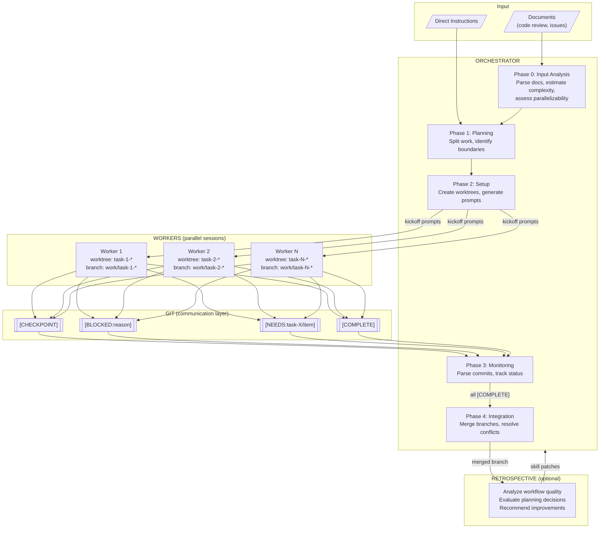

# Parallel Workflow Skills for Claude Code

Coordinate multiple Claude Code sessions working in parallel on the same codebase using git worktrees.

## Architecture



## Overview

Three Claude Code skills that work together:

| Skill | Purpose | Lines |
|-------|---------|-------|
| `parallel-orchestrator` | Splits work, creates worktrees, monitors progress, integrates | 584 |
| `parallel-worker` | Executes assigned tasks, commits with status prefixes | 424 |
| `parallel-retrospective` | Analyzes completed workflows, recommends improvements | 569 |

## When to Use

Parallel execution is worthwhile when:
- Task can be split into 3+ independent workstreams
- Total estimated work exceeds 2 hours
- Files/directories have clear ownership boundaries
- Cross-dependencies are minimal or predictable

Examples: code review with 20 issues, feature spanning backend/frontend/tests, refactoring across independent modules.

## Installation

See [INSTALL.md](INSTALL.md) for three installation options. See [CHEATSHEET.md](CHEATSHEET.md) for quick reference.

## Usage

### 1. Start Orchestrator

From documents:
```
Use the parallel-orchestrator skill to analyze these documents and propose
a parallel workflow:

@code_review.md
@missing_tests.md
```

From instructions:
```
Use the parallel-orchestrator skill to split this task into parallel workstreams:

Add user authentication with:
- Database models for users and sessions
- REST API endpoints for login/logout/register
- Frontend login form and session management
```

### 2. Launch Workers

Copy each generated kickoff prompt into a new Claude Code session.

### 3. Monitor

```
Check on the parallel workers and show me their status.
```

### 4. Integrate

```
All workers are complete. Integrate the changes and prepare for merge to main.
```

### 5. Retrospective (optional)

```
Use the parallel-retrospective skill to analyze the completed workflow.

Feature: user-authentication
Integration branch: integration/user-auth
Worker branches: work/task-1-models, work/task-2-api, work/task-3-frontend
```

## Conventions

### Commit Prefixes

| Prefix | Meaning |
|--------|---------|
| `[CHECKPOINT]` | Subtask complete, continuing |
| `[BLOCKED:reason]` | Cannot proceed |
| `[NEEDS:task-X/item]` | Requires output from another worker |
| `[COMPLETE]` | All assigned tasks finished |

### Naming

| Item | Pattern |
|------|---------|
| Worktree | `worktrees/task-<id>-<description>/` |
| Branch | `work/task-<id>-<description>` |
| Integration | `integration/<feature>` |

## Customization

Skills were generated using included builder prompts. Regenerate with modifications:

```
Read @orchestrator_skill_builder_prompt.md and create the skills with:
- [WIP] instead of [CHECKPOINT] for commit prefixes
- feature/ instead of work/ for branch prefixes
- Requirement that workers run tests before [COMPLETE]
```

Builder prompts:
- `orchestrator_skill_builder_prompt.md` - Orchestrator and worker skills
- `orchestrator_retrospective_skill_builder_prompt.md` - Retrospective skill

## Design Rationale

**Git as communication layer.** Workers never communicate directly. All coordination happens through git commits. Simple, auditable, scales to any number of workers.

**Human in the loop.** Orchestrator outputs commands and prompts; you execute them. You spawn worker sessions manually. Maintains visibility and control.

**Phase 0 input analysis.** Orchestrator parses markdown documents, estimates complexity, discovers dependencies, and assesses whether parallelization is appropriate before proposing a split.

**Feedback loop.** Retrospective analyzes planning decisions (complexity estimates, grouping effectiveness) and can recommend skill patches for future workflows.

## Limitations

- Manual session spawning required
- Best for clearly separable tasks
- Merge conflicts require manual resolution
- Overhead not justified for small tasks (<3 items, <2 hours)

## License

MIT
